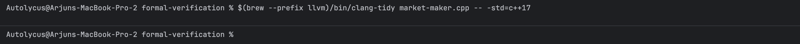
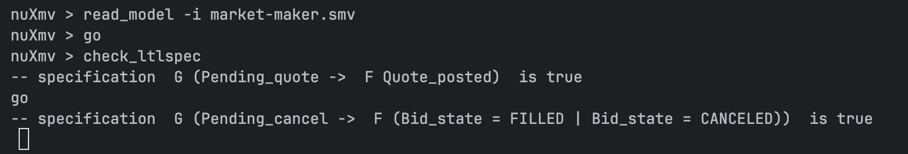

# Instructions for running the Code
This directory holds many files:
1. **market-maker.cpp** is our market making algorithm implemented in C++.
2. **market-maker.smv** is our symbolic model checker implemented in nuXml.
3. **prism_model.pm** is our probabilistic model checker implemented in PRISM.
4. **liveness.ltl** and **safety.pctl** are definitions for our verifiable properties.
5. **presentation.pdf** is a copy of the presentation slides we used for our final presentation.

## Running Our Static Analysis Tool
We used clang-tidy to perform static analysis on our codebase, see below for the most recent output.



If you wish to run static analysis by yourself, please do the following steps...
1. <code>brew install llvm</code> (If this is your first time using clang-tidy)
2. $(brew --prefix llvm)/bin/clang-tidy market-maker.cpp -- -std=c++17


## Running Our nuXmv Model Checker
We used nuXmv to create our symbolic model checker.

If this is your first time using nuXmv, please go to https://nuxmv.fbk.eu/download.html and follow the download instructions that best fit your device.

### Running Unbounded Analysis for nuXmv
If you wish to run unbounded analysis using our nuXmv model checker, please run the following commands...
1. nuXmv -int (starts nuxmv in interactive mode)
2. read_model -i market-maker.smv (parses the model)
3. go (builds the symbolic FSM)
4. check_ltlspec and/or check_ctlspec (based on your needs)

Keep in mind, unbounded model checking each specification for all execution lengths. Please be warned that our state space is quite large, and such an analysis will take significant processing time. Below is an image of our unbounded model checking completing 2 propeties validations over 18 hours.


### Running Bounded Analysis for nuXmv
If you wish to run unbounded analysis using our nuXmv model checker, please run the following commands...
1. nuXmv -int
2. read_model -i market-maker.smv
3. go_bmc
4. check_ltlspec_bmc -k X (where X is your chosen bound)

Bounded model checking searches for counterexamples for up to a fixed bound X. This is much faster, and we suggest you start off using this for debugging or testing.

If you wish to see an example of an output, please see the txt output files found in our examples directory.

**bounded-analysis-fail-20.txt** holds the output file for an earlier run, where the liveness principle was violated, and the subsequent trace. This bugs is mentioned in our paper and was helpful in finding a logical issue in our model.
**bounded-analysis-100.txt** holds the successful output for a bounded run of bound 20, 30 and 100 done subsequently.

### Viewing Counter-example Traces for nuXmv
Should a specification fail, you can always print the counter-example trace using <code>show_traces</code>.

## Running Our PRISM Model Checker
If this is your first time using PRISM, please go to https://www.prismmodelchecker.org/download.php and follow the download instructions that best fit your device.

### Bad PRISM Model
bad_prism_model.pm contains an abstract model that incorreclty models the source code.
All of the liveness and safety properties can be verified using the following command: ```.\bad_prism_properties.ps1```

### Good PRISM Model
The correct abstract model can be verified using the following command: ```.\good_prism_properties.ps1```

### References
https://nuxmv.fbk.eu/downloads/nuxmv-user-manual.pdf
Used for nuXmv development. 